# Person state and animation checklist

Status: working contract

Scope: person-state visuals, movement overlays, and state transitions

Asset source: the owner's `data/original_game` files, decoded with `pop_extract unit-animations`

## Unit checklists

- [Brave](unit-animation-checklists/brave.md)
- [Warrior](unit-animation-checklists/warrior.md)
- [Preacher](unit-animation-checklists/preacher.md)
- [Spy](unit-animation-checklists/spy.md)
- [Firewarrior](unit-animation-checklists/firewarrior.md)
- [Shaman](unit-animation-checklists/shaman.md)

Each unit document lists its logical IDs and extracted frames. This document owns shared state and mechanic rules.

The shared tables use brave frames as representative previews because construction accepts braves. Do not apply a brave logical ID to another subtype. Use the unit checklist for subtype-specific IDs and renderer support.

## Rules

1. `PersonState` describes behavior. It does not identify a sprite sequence.
2. A native animation-table row selects a logical animation ID for each person subtype.
3. The logical ID resolves to a VSTART index and render type. The renderer must honor both fields. A correct ID with the wrong render type can produce another unit's body or props.
4. Motion can sit outside the sprite sequence. Foundation work uses brave walk frames plus a vertical hop. Vehicle travel, drowning, and teleporting may need similar overlays.
5. A state can use more than one row. Speed, subphase, arrival, and one-shot transitions select the visible sequence.

### Evidence labels

| Label | Meaning |
|---|---|
| ✅ Confirmed | Binary mapping and extracted frames agree. A gameplay capture confirms the result. |
| 🧪 Test | The Rust mapping and extracted frames agree. A gameplay capture remains open. |
| ❌ Mismatch | A gameplay capture disproves the Rust result. |
| ⬜ Open | Native handler work or a reference capture must determine the mapping. |

The preview strips show blue-tribe frames from one stored direction. They show sprite identity and frame order. They do not show timing, camera-facing mirroring, terrain height, or movement.

## Construction contract

`PersonState::Building` covers several jobs. The renderer must inspect the construction subphase instead of assigning one animation to the whole state.

| Check | Construction subphase | Sprite contract | Motion and transition contract | Evidence |
|---|---|---|---|---|
| [ ] | Travel to an uneven footprint vertex | Walk row 1, brave ID 21 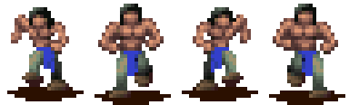 | Follow the path. Keep feet on sampled terrain. Stop at the assigned vertex. | 🧪 ID and frames confirmed; gameplay capture open |
| [ ] | Flatten one footprint vertex | Walk row 1, brave ID 21  | Apply a vertical hop without changing canonical X/Z. Change one terrain vertex on landing. Keep each hop and sprite cycle phase-locked. | ❌ The prior app ran in place. Acceptance requires the missing height arc and a matching capture. |
| [ ] | Travel to a reserved tree | Walk row 1, brave ID 21  | Keep the brave subtype. Release the reservation if the tree disappears. | 🧪 Behavior exists; capture open |
| [ ] | Remove one wood unit from a tree | Work row 13 candidate, brave ID 73 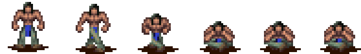 | Hold position at the tree. Consume one reserved wood unit at the end of the pass. | ⬜ The table name `Wrk5` does not prove that this row is the tree-work action. Compare against the original game. |
| [ ] | Carry wood to the site | Carry row 18 candidate, brave ID 88 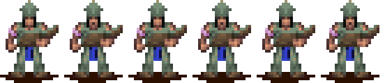 | Follow the path with one wood unit. Preserve subtype 2. Render the wood prop through the ID 88 render type. | ❌ The player saw a preacher-shaped unit. Inspect VSTART/render-type composition before changing the ID. |
| [ ] | Deposit wood | ⬜ Unassigned transition sequence | Remove the carried prop after arrival. Credit one reserved wood unit once. | ⬜ Capture the original deposit transition. |
| [ ] | Work the scaffold | ⬜ Choose among work rows after capture 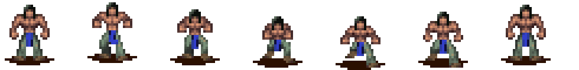 | Hold a valid work point. Advance the scaffold at the native cadence. | ⬜ Current walk-row fallback has no native evidence. |
| [ ] | Finalize and leave | ⬜ Unassigned | Complete the model once. Send workers past the entrance without changing the building angle. | 🧪 Exit behavior exists; transition animation open. |

### Construction acceptance sequence

- [ ] Capture the original at 30 or 60 frames per second from footprint placement through the first wood delivery.
- [ ] Record, for each brave, state value, subphase, subtype, logical animation ID, resolved render type, frame index, X/Z, and render-height offset.
- [ ] Capture the Rust fixture at the same event boundaries.
- [ ] Confirm that subtype stays `2` through tree work and carrying.
- [ ] Confirm that a landing changes one footprint vertex and that travel frames have zero hop offset.
- [ ] Confirm that the wood prop appears during the carry and disappears after deposit.

## Current state checklist

### Movement and markers

| Check | Native state | Planned visible animation | Notes |
|---|---|---|---|
| [ ] | `Idle` `0x01` | Idle row 0, brave ID 15 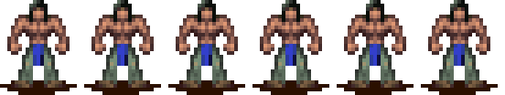 | ✅ Asset mapping confirmed. Capture cadence and random idle variation. |
| [ ] | `Moving` `0x03` | Idle row 0 at zero speed; walk row 1 while moving  | ✅ Native selector checks the speed word. |
| [ ] | `Wander` `0x04` | Walk while moving; idle while stopped  | 🧪 Rust mapping exists. |
| [ ] | `GoToPoint` `0x05`, native `STATE_WAIT` | ⬜ Capture before assignment | The Rust name conflicts with native movement notes. Resolve the behavior before locking a row. |
| [ ] | `FollowPath` `0x06` | Walk while moving; idle while stopped  | 🧪 Rust mapping exists. |
| [ ] | `GoToMarker` `0x07`, native `STATE_GOTO` | Walk while moving; idle on arrival  | 🧪 Player move orders use this state. |
| [ ] | `WaitForPath` `0x08` | Idle row 0  | 🧪 Keep the unit grounded while the path request waits. |
| [ ] | `WaitAtMarker` `0x09` | Idle row 0  | 🧪 Rust speed fallback selects idle. |
| [ ] | `Fleeing` `0x1A` | Run row 25, brave ID 156 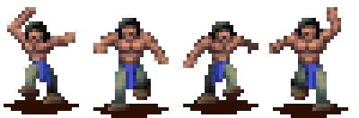 | 🧪 Native entry selector uses row 25. Capture the end transition. |

### Buildings, training, and economy

| Check | Native state | Planned visible animation | Notes |
|---|---|---|---|
| [ ] | `EnterBuilding` `0x0A` | Walk until the entrance  | 🧪 Hide or transition only after the entrance threshold. |
| [ ] | `InsideBuilding` `0x0B` | Action row 3 candidate, brave ID 32  | ⬜ The native entry selector chooses row 3. The building may hide the person before any frame reaches the world renderer. |
| [ ] | `InsideTraining` `0x0C` | Idle row 0 candidate  | ⬜ Native entry default uses idle. Visibility remains open. |
| [ ] | `Building` `0x0D` | Use the construction subphase table above | ❌ One fixed action row produced prayer or death poses. One fixed walk row omitted the hop. |
| [ ] | `InTraining` `0x0E` | Action row 3 candidate  | ⬜ Native entry selector chooses row 3. Training handlers may override it. |
| [ ] | `WaitOutside` `0x0F` | Native logical ID 2, preview not extracted | ⬜ Extract ID 2 and identify its render type before implementation. |
| [ ] | `Training` `0x10` | Native logical ID 3, preview not extracted | ⬜ Extract ID 3 and capture the training-building transition. |
| [ ] | `Housing` `0x11` | ⬜ Unassigned | A housed person may have no world sprite. Confirm spawn and exit behavior. |
| [ ] | `Gathering` `0x13` | Walk to the reserved tree, idle if stopped  | 🧪 Rust construction behavior uses this as tree travel. Native entry default uses idle before movement setup. |
| [ ] | `GatheringWood` `0x15` | Work row 13 candidate, brave ID 73  | ⬜ Verify against the original tree-work capture. |
| [ ] | `CarryingWood` `0x16` | Carry row 18 candidate, brave ID 88  | ❌ The runtime result changed the brave's apparent class. Keep the candidate ID and audit render-type composition. |

### Combat, conversion, and lifecycle

| Check | Native state | Planned visible animation | Notes |
|---|---|---|---|
| [ ] | `Dying` `0x02` | Die row 6, brave ID 27 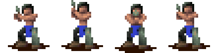 | 🧪 Play once. Do not loop. |
| [ ] | `Dead` `0x18` | Hold the final death frame  | ⬜ Native entry default is not the final visible mapping. The death handler owns the override. |
| [ ] | `Fighting` `0x19` | Action row 3 candidate, brave ID 32  | ⬜ Native entry starts from idle. Combat handlers select attack and hit reactions. |
| [ ] | `Spawning` `0x1B` | ⬜ Unassigned | Capture hut birth and reincarnation spawn as separate cases. |
| [ ] | `BeingSacrificed` `0x1C` | ⬜ Unassigned | Do not reuse death until the original sequence confirms it. |
| [ ] | `InShield` `0x1D` | Idle row 0 plus shield effect  | 🧪 Native entry default uses idle. |
| [ ] | `InShieldIdle` `0x1E` | Idle row 0 plus shield effect  | ⬜ Confirm the difference from `InShield`. |
| [ ] | `Preaching` `0x1F` | Run while chasing; action or work row at the target   | ⬜ Native entry selector supplies run. The preaching handler must choose the target action. |
| [ ] | `SitDown` `0x20` | Four seated rows, brave IDs 131, 136, 141, and 146 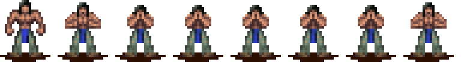 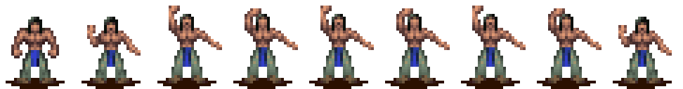 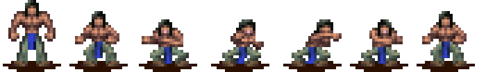  | ⬜ Rust selects only `Sit1`. Determine the native variant selector and exit sequence. |
| [ ] | `BeingConverted` `0x21` | ⬜ Unassigned | Capture target reaction and conversion effect as separate layers. |
| [ ] | `WaitingAfterConvert` `0x22` | Idle row 0 candidate  | ⬜ Confirm the hold duration and tribe-color switch tick. |
| [ ] | `Celebrating` `0x29` | Celebrate row 7, brave ID 38 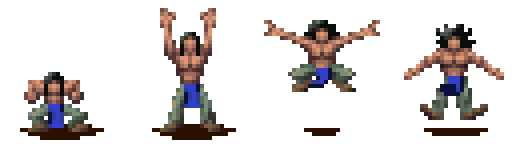 | 🧪 Row mapping exists. Capture loop and exit rules. |
| [ ] | `Teleporting` `0x2A` | Special candidate, brave ID 100 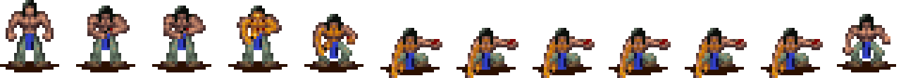 | ⬜ State entry defaults to walk. The teleport handler and effect system must supply the final visuals. |
| [ ] | `InternalState` `0x2B` | Dig/build candidates, brave IDs 115 and 120 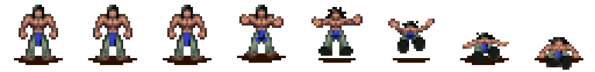 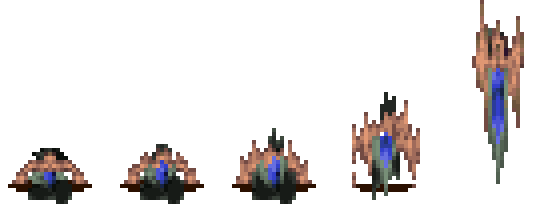 | ⬜ Identify call sites before assigning either row. These rows caused false death and prayer-like construction poses. |
| [ ] | `WaitingAtReincPillar` `0x2C` | Idle row 0 candidate  | 🧪 Native entry default uses idle. Capture the transition into `Spawning`. |

### Water and vehicles

| Check | Native state | Planned visible animation | Notes |
|---|---|---|---|
| [ ] | `Drowning` `0x17` | Swim row 16, then die; brave IDs 83 and 27   | ⬜ Capture the waterline offset and final transition. |
| [ ] | `WaitingForBoat` `0x23` | Idle row 0  | 🧪 Keep the person on terrain until boarding starts. |
| [ ] | `Placeholder` `0x24` | ⬜ Unassigned | Find native call sites before implementing visuals. |
| [ ] | `GetOffBoat` `0x25` | Walk candidate  | ⬜ Capture boat-to-shore height and visibility changes. |
| [ ] | `WaitingInWater` `0x26` | Swim row 16, brave ID 83  | 🧪 Rust maps this state to swim. Verify waterline placement. |
| [ ] | `EnteringVehicle` `0x27` | Walk to vehicle, then vehicle or ride row  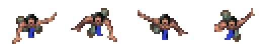 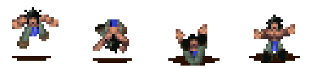 | ⬜ Native entry starts from idle. Vehicle handlers own the visible transition. |
| [ ] | `ExitingVehicle` `0x28` | Run row 25 candidate, brave ID 156  | 🧪 Native entry selector uses row 25. Capture placement and first grounded frame. |

## Native animation-row catalog

The logical ID column lists the brave ID unless the row lacks one. The table names come from the reverse-engineered animation table. Names such as `Wrk1` and `Int2` remain labels, not mechanic assignments.

| Row | Table label | Representative logical ID and extracted frames | Assignment status |
|---:|---|---|---|
| 0 | Idle | Brave 15  | Used |
| 1 | Walk | Brave 21  | Used |
| 2 | Ride | Brave 110  | Open mechanic |
| 3 | Action | Brave 32  | Used by combat/training candidates; rejected for foundation flattening |
| 4 | Spell idle | Brave 43 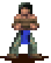 | Spell mechanics out of the construction milestone |
| 5 | Spell walk | Brave 48 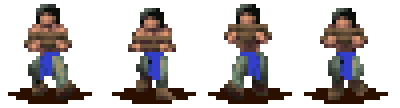 | Spell mechanics out of the construction milestone |
| 6 | Die | Brave 27  | Used |
| 7 | Celebrate | Brave 38  | Used |
| 8 | Wrk1 | Brave 53 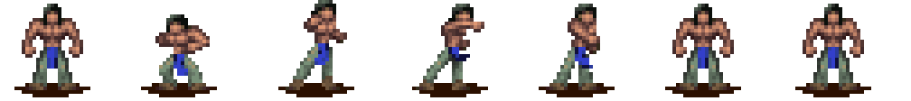 | Mechanic unknown |
| 9 | Wrk2 | Brave 58 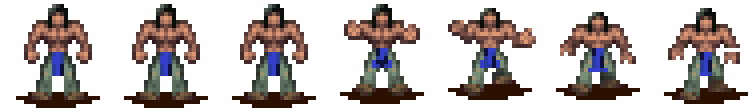 | Mechanic unknown |
| 10 | Wrk3 | Brave 63  | Scaffold candidate |
| 11 | Wrk4 | Brave 68  | Mechanic unknown |
| 12 | Vehicle | Brave 78  | Open mechanic |
| 13 | Wrk5 | Brave 73  | Tree-work candidate |
| 14 | Special | Brave 100  | Mechanic unknown |
| 15 | Sham | Logical-ID table and extractor classification conflict 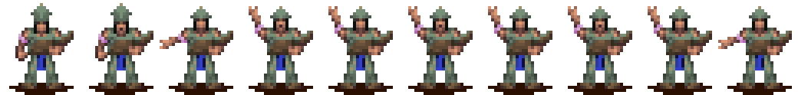 | Audit subtype ownership before use |
| 16 | Swim | Brave 83  | Used |
| 17 | Unknown | Shaman 107 is the only table entry 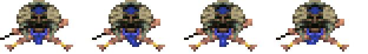 | Mechanic unknown |
| 18 | Carry | Brave 88  | Runtime composition mismatch |
| 19 | Int1 / Dig | Brave 115  | Mechanic unknown |
| 20 | Int2 / Build | Brave 120  | Mechanic unknown |
| 21 | Sit1 | Brave 131  | Variant selector open |
| 22 | Sit2 | Brave 136  | Variant selector open |
| 23 | Sit3 | Brave 141  | Variant selector open |
| 24 | Sit4 | Brave 146  | Variant selector open |
| 25 | Run | Brave 156  | Used |

## Implementation order

1. Add a diagnostic record for semantic state, subphase, subtype, logical ID, resolved VSTART, render type, and movement overlays.
2. Finish the construction sequence through first wood deposit. Use the construction acceptance sequence above as the merge gate.
3. Capture one deterministic fixture for each animation row that the runtime uses.
4. Implement the remaining states by mechanic: buildings and training, combat and conversion, then water and vehicles.

Do not mark a row complete from an atlas preview. The checklist requires an original-game capture and a matching Rust gameplay capture.
