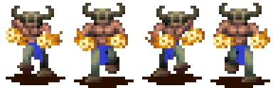
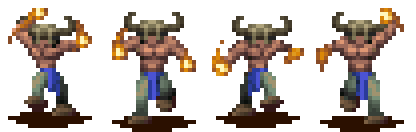
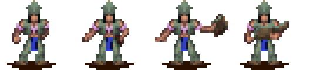
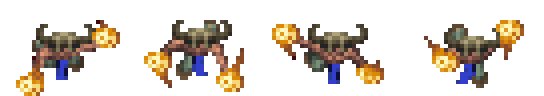
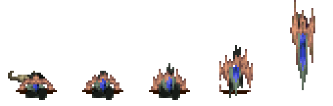

# Firewarrior animation checklist

Native subtype: `6`

Primary mechanics: training, movement, ranged fire attacks, melee combat, vehicles, and water

Extracted original-game sequences: `24`

Shared rules: [person state and animation checklist](../person-state-animation-checklist.md)

## Current Rust state adapter

| Check | Exact `PersonState` values | Row and firewarrior ID | Verification |
|---|---|---|---|
| [ ] | `Idle`, `InsideTraining`, `InShield`, `WaitingAtReincPillar` | Idle row 0, ID 19 | Capture open |
| [ ] | `Moving`, `Wander`, `GoToPoint`, `FollowPath`, `GoToMarker`, `WaitForPath`, `WaitAtMarker`, `EnterBuilding`, `WaitOutside`, `Training`, `Housing`, `Gathering`, `Spawning`, `BeingConverted`, `WaitingAfterConvert`, `WaitingForBoat`, `Placeholder`, `GetOffBoat`, `EnteringVehicle`, `Teleporting`, `InternalState`, `InShieldIdle` | Walk row 1, ID 25; zero speed falls back to ID 19 | Mixed verified and provisional mappings |
| [ ] | `InsideBuilding`, `InTraining`, `Fighting` | Action row 3, ID 36 | Handler overrides open |
| [ ] | `Dying`, `Dead`, `BeingSacrificed` | Die row 6, ID 31 | Sacrifice mapping open |
| [ ] | `Celebrating` | Celebrate row 7, ID 42 | Capture open |
| [ ] | `GatheringWood` | Work row 13, ID 77 | Mechanic assignment open |
| [ ] | `Drowning`, `WaitingInWater` | Swim row 16, ID 87 | Waterline capture open |
| [ ] | `CarryingWood` | Carry row 18, ID 92 | Mechanic assignment open |
| [ ] | `Building` | Walk row 1, ID 25 | Firewarriors must not receive brave construction jobs |
| [ ] | `SitDown` | Sit row 21, ID 135 | Three other variants remain unselected |
| [ ] | `Fleeing`, `Preaching`, `ExitingVehicle` | Run row 25, ID 160 | Handler use open |

## State mapping

| Check | States or mechanic | Planned sequence | Status |
|---|---|---|---|
| [ ] | Idle-class states | Idle row 0, ID 19  | Cadence capture open |
| [ ] | Moving, path, marker, and entrance travel | Walk row 1, ID 25  | Runtime mapping exists |
| [ ] | Fighting and training actions | Action row 3, ID 36  | Attack timing open |
| [ ] | Ranged fire attack | Special candidate, ID 101  | Extracted body and flame layers match firewarrior; native table ownership needs audit |
| [ ] | Dying and dead hold | Die row 6, ID 31  | One-shot and final-frame rules open |
| [ ] | Fleeing and fast exit | Run row 25, ID 160  | Exit capture open |
| [ ] | Drowning and waiting in water | Swim row 16, ID 87  | Waterline offset open |
| [ ] | SitDown | IDs 135, 140, 145, and 150 | Variant selector open |
| [ ] | Vehicle entry, travel, and exit | Walk, vehicle ID 82, ride ID 114, then run | Transition capture open |
| [ ] | Carry, dig, build, and work rows | Extracted but unassigned | Do not inherit brave construction rules |
| [ ] | Spawning, sacrifice, conversion, teleport, and internal states | Unassigned | Handler evidence required |

## Extracted sequence inventory

| Check | Native row or sequence | Logical ID | Original frames |
|---|---|---:|---|
| [ ] | Idle | 19 |  |
| [ ] | Walk | 25 |  |
| [ ] | Die | 31 |  |
| [ ] | Action | 36 |  |
| [ ] | Celebrate | 42 |  |
| [ ] | Spell idle | 47 |  |
| [ ] | Spell walk | 52 |  |
| [ ] | Work 1 | 57 |  |
| [ ] | Work 2 | 62 |  |
| [ ] | Work 3 | 67 |  |
| [ ] | Work 4 | 72 |  |
| [ ] | Work 5 | 77 |  |
| [ ] | Vehicle | 82 |  |
| [ ] | Swim | 87 |  |
| [ ] | Carry | 92 |  |
| [ ] | Special | 101 |  |
| [ ] | Ride | 114 |  |
| [ ] | Dig / internal 1 | 119 |  |
| [ ] | Build / internal 2 | 124 |  |
| [ ] | Sit 1 | 135 |  |
| [ ] | Sit 2 | 140 |  |
| [ ] | Sit 3 | 145 |  |
| [ ] | Sit 4 | 150 |  |
| [ ] | Run | 160 |  |

## Acceptance

- [ ] The renderer keeps subtype `6` through each state transition.
- [ ] The resolved VSTART and render type match the logical ID.
- [ ] The Rust frame count and order match the strip.
- [ ] Training produces subtype `6` at the building entrance.
- [ ] The ranged attack synchronizes the flame projectile with its release frame.
- [ ] A binary audit resolves logical ID 101 ownership.
