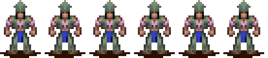
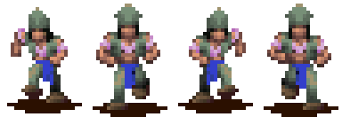
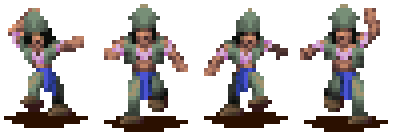
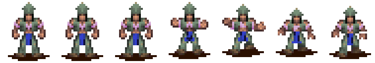
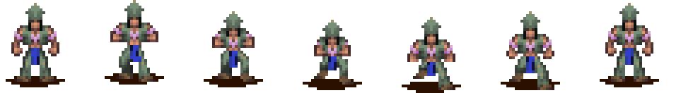
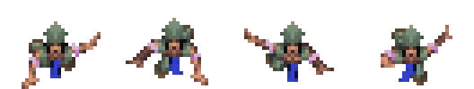
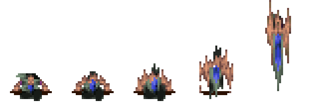
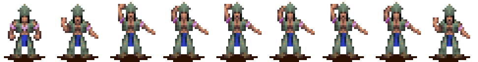

# Preacher animation checklist

Native subtype: `4`

Primary mechanics: training, movement, preaching, conversion pressure, combat, vehicles, and water

Extracted original-game sequences: `23`

Shared rules: [person state and animation checklist](../person-state-animation-checklist.md)

## Current Rust state adapter

| Check | Exact `PersonState` values | Row and preacher ID | Verification |
|---|---|---|---|
| [ ] | `Idle`, `InsideTraining`, `InShield`, `WaitingAtReincPillar` | Idle row 0, ID 17 | Capture open |
| [ ] | `Moving`, `Wander`, `GoToPoint`, `FollowPath`, `GoToMarker`, `WaitForPath`, `WaitAtMarker`, `EnterBuilding`, `WaitOutside`, `Training`, `Housing`, `Gathering`, `Spawning`, `BeingConverted`, `WaitingAfterConvert`, `WaitingForBoat`, `Placeholder`, `GetOffBoat`, `EnteringVehicle`, `Teleporting`, `InternalState`, `InShieldIdle` | Walk row 1, ID 23; zero speed falls back to ID 17 | Mixed verified and provisional mappings |
| [ ] | `InsideBuilding`, `InTraining`, `Fighting` | Action row 3, ID 34 | Handler overrides open |
| [ ] | `Dying`, `Dead`, `BeingSacrificed` | Die row 6, ID 29 | Sacrifice mapping open |
| [ ] | `Celebrating` | Celebrate row 7, ID 40 | Capture open |
| [ ] | `GatheringWood` | Work row 13, ID 75 | Mechanic assignment open |
| [ ] | `Drowning`, `WaitingInWater` | Swim row 16, ID 85 | Waterline capture open |
| [ ] | `CarryingWood` | Carry row 18, ID 90 | Mechanic assignment open |
| [ ] | `Building` | Walk row 1, ID 23 | Preachers must not receive brave construction jobs |
| [ ] | `SitDown` | Sit row 21, ID 133 | Three other variants remain unselected |
| [ ] | `Fleeing`, `Preaching`, `ExitingVehicle` | Run row 25, ID 158 | Preaching target action open |

## State mapping

| Check | States or mechanic | Planned sequence | Status |
|---|---|---|---|
| [ ] | Idle-class states | Idle row 0, ID 17  | Cadence capture open |
| [ ] | Moving, path, marker, and entrance travel | Walk row 1, ID 23  | Runtime mapping exists |
| [ ] | Preaching target travel | Run row 25, ID 158  | Native entry mapping exists |
| [ ] | Preaching at target | Action or work row, unassigned  | Original target-action capture required |
| [ ] | Fighting and training actions | Action row 3, ID 34  | Attack and preaching actions need separate evidence |
| [ ] | Dying and dead hold | Die row 6, ID 29  | One-shot and final-frame rules open |
| [ ] | Drowning and waiting in water | Swim row 16, ID 85  | Waterline offset open |
| [ ] | SitDown | IDs 133, 138, 143, and 148 | Variant selector open |
| [ ] | Vehicle entry, travel, and exit | Walk, vehicle ID 80, ride ID 112, then run | Transition capture open |
| [ ] | Carry, dig, build, and work rows | Extracted but unassigned | Do not inherit brave construction rules |
| [ ] | Conversion reaction, spawning, sacrifice, teleport, and internal states | Unassigned | Handler evidence required |

## Extracted sequence inventory

| Check | Native row or sequence | Logical ID | Original frames |
|---|---|---:|---|
| [ ] | Idle | 17 |  |
| [ ] | Walk | 23 |  |
| [ ] | Die | 29 |  |
| [ ] | Action | 34 |  |
| [ ] | Celebrate | 40 |  |
| [ ] | Spell idle | 45 |  |
| [ ] | Spell walk | 50 |  |
| [ ] | Work 1 | 55 |  |
| [ ] | Work 2 | 60 |  |
| [ ] | Work 3 | 65 |  |
| [ ] | Work 4 | 70 |  |
| [ ] | Work 5 | 75 |  |
| [ ] | Vehicle | 80 |  |
| [ ] | Swim | 85 |  |
| [ ] | Carry | 90 |  |
| [ ] | Ride | 112 |  |
| [ ] | Dig / internal 1 | 117 |  |
| [ ] | Build / internal 2 | 122 |  |
| [ ] | Sit 1 | 133 |  |
| [ ] | Sit 2 | 138 |  |
| [ ] | Sit 3 | 143 |  |
| [ ] | Sit 4 | 148 |  |
| [ ] | Run | 158 |  |

## Acceptance

- [ ] The renderer keeps subtype `4` through each state transition.
- [ ] The resolved VSTART and render type match the logical ID.
- [ ] The Rust frame count and order match the strip.
- [ ] Training produces subtype `4` at the building entrance.
- [ ] Preaching travel and target action use separate verified sequences.
