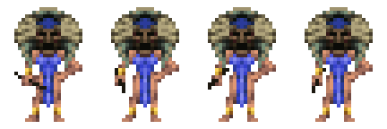
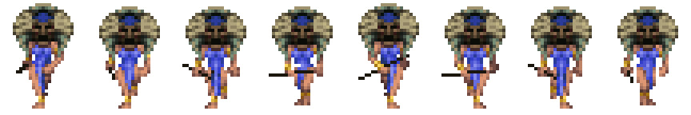
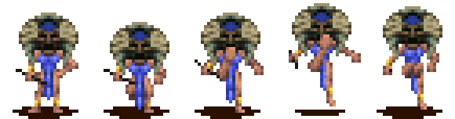
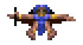
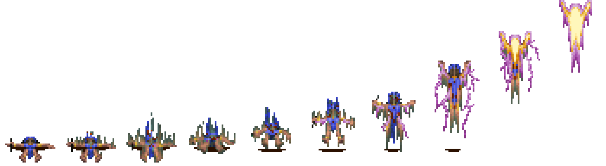

# Shaman animation checklist

Native subtype: `7`

Primary mechanics: movement, spell casting, reincarnation, combat, vehicles, and water

Extracted original-game sequences: `12`

Shared rules: [person state and animation checklist](../person-state-animation-checklist.md)

Shaman idle and walk use direct per-tribe sprites. The other extracted sequences use composited VELE chains. The renderer keeps them in separate atlas buckets.

## Current Rust state adapter

| Check | Exact `PersonState` values | Row and shaman ID | Verification |
|---|---|---|---|
| [ ] | `Idle`, `InsideTraining`, `InShield`, `WaitingAtReincPillar` | Idle row 0, ID 20 | Direct mapping exists |
| [ ] | `Moving`, `Wander`, `GoToPoint`, `FollowPath`, `GoToMarker`, `WaitForPath`, `WaitAtMarker`, `EnterBuilding`, `WaitOutside`, `Training`, `Housing`, `Gathering`, `Spawning`, `BeingConverted`, `WaitingAfterConvert`, `WaitingForBoat`, `Placeholder`, `GetOffBoat`, `EnteringVehicle`, `Teleporting`, `InternalState`, `InShieldIdle` | Walk row 1, ID 26; zero speed falls back to ID 20 | Mixed verified and provisional mappings |
| [ ] | `InsideBuilding`, `InTraining`, `Fighting` | Action row 3, ID 37 | Composited handler timing open |
| [ ] | `Dying`, `Dead`, `BeingSacrificed` | Table fallback ID 20 | Dedicated death sequence unresolved |
| [ ] | `Celebrating` | Table fallback ID 20 | Dedicated celebration sequence unresolved |
| [ ] | `GatheringWood` | Table fallback ID 20 | Shaman mechanic assignment open |
| [ ] | `Drowning`, `WaitingInWater` | Swim row 16, ID 125 | Waterline capture open |
| [ ] | `CarryingWood` | Carry row 18, ID 127 | Mechanic assignment open |
| [ ] | `Building` | Walk row 1, ID 26 | Shamans must not receive brave construction jobs |
| [ ] | `SitDown` | Table fallback ID 20 | Seated shaman sequence unresolved |
| [ ] | `Fleeing`, `Preaching`, `ExitingVehicle` | Run-table fallback ID 26 | Dedicated run sequence unresolved |

## State mapping

| Check | States or mechanic | Planned sequence | Status |
|---|---|---|---|
| [ ] | Idle-class states | Direct idle, ID 20  | Direct atlas mapping exists |
| [ ] | Moving, path, marker, and entrance travel | Direct walk, ID 26  | Direct atlas mapping exists |
| [ ] | Close action or combat | Composited action, ID 37  | One-frame source needs handler timing |
| [ ] | Spell or special action | Special candidate, ID 94  | Mechanic and release frame open |
| [ ] | Work or cast variant | Work 1 candidate, ID 106  | Call-site audit required |
| [ ] | Drowning and waiting in water | Swim, ID 125  | Waterline offset open |
| [ ] | Vehicle entry, travel, and exit | Walk, vehicle ID 107, ride ID 129 | Transition capture open |
| [ ] | Reincarnation and spawning | Build ID 128 or unknown ID 109 candidate | Capture the pillar sequence before assignment |
| [ ] | Dying, dead, celebration, run, and seated states | No dedicated extracted shaman row | Determine native fallback and effect layers |
| [ ] | Carry and internal states | IDs 127, 126, and 128 extracted but unassigned | Handler evidence required |

## Extracted sequence inventory

| Check | Sequence | Logical ID | Source | Original frames |
|---|---|---:|---|---|
| [ ] | Idle | 20 | Direct |  |
| [ ] | Walk | 26 | Direct |  |
| [ ] | Action | 37 | Composited |  |
| [ ] | Special | 94 | Composited |  |
| [ ] | Work 1 | 106 | Composited |  |
| [ ] | Vehicle | 107 | Composited |  |
| [ ] | Unknown 109 | 109 | Composited |  |
| [ ] | Swim | 125 | Composited |  |
| [ ] | Dig / internal 1 | 126 | Composited |  |
| [ ] | Carry | 127 | Composited |  |
| [ ] | Build / internal 2 | 128 | Composited |  |
| [ ] | Ride | 129 | Composited |  |

## Acceptance

- [ ] The renderer keeps subtype `7` through each state transition.
- [ ] Direct idle/walk selection does not sample a composited atlas.
- [ ] Composited actions resolve the correct VSTART and render type.
- [ ] The Rust frame count and order match each strip.
- [ ] Reincarnation capture identifies IDs 109 and 128 before implementation.
- [ ] Spell work remains outside the construction milestone.
