# Spy animation checklist

Native subtype: `5`

Primary mechanics: training, movement, disguise and infiltration, combat, vehicles, and water

Extracted original-game sequences: `23`

Shared rules: [person state and animation checklist](../person-state-animation-checklist.md)

## Current Rust state adapter

| Check | Exact `PersonState` values | Row and spy ID | Verification |
|---|---|---|---|
| [ ] | `Idle`, `InsideTraining`, `InShield`, `WaitingAtReincPillar` | Idle row 0, ID 18 | Capture open |
| [ ] | `Moving`, `Wander`, `GoToPoint`, `FollowPath`, `GoToMarker`, `WaitForPath`, `WaitAtMarker`, `EnterBuilding`, `WaitOutside`, `Training`, `Housing`, `Gathering`, `Spawning`, `BeingConverted`, `WaitingAfterConvert`, `WaitingForBoat`, `Placeholder`, `GetOffBoat`, `EnteringVehicle`, `Teleporting`, `InternalState`, `InShieldIdle` | Walk row 1, ID 24; zero speed falls back to ID 18 | Mixed verified and provisional mappings |
| [ ] | `InsideBuilding`, `InTraining`, `Fighting` | Action row 3, ID 35 | Handler overrides open |
| [ ] | `Dying`, `Dead`, `BeingSacrificed` | Die row 6, ID 30 | Sacrifice mapping open |
| [ ] | `Celebrating` | Celebrate row 7, ID 41 | Capture open |
| [ ] | `GatheringWood` | Work row 13, ID 76 | Mechanic assignment open |
| [ ] | `Drowning`, `WaitingInWater` | Swim row 16, ID 86 | Waterline capture open |
| [ ] | `CarryingWood` | Carry row 18, ID 91 | Mechanic assignment open |
| [ ] | `Building` | Walk row 1, ID 24 | Spies must not receive brave construction jobs |
| [ ] | `SitDown` | Sit row 21, ID 134 | Three other variants remain unselected |
| [ ] | `Fleeing`, `Preaching`, `ExitingVehicle` | Run row 25, ID 159 | Handler use open |

## State mapping

| Check | States or mechanic | Planned sequence | Status |
|---|---|---|---|
| [ ] | Idle-class states | Idle row 0, ID 18 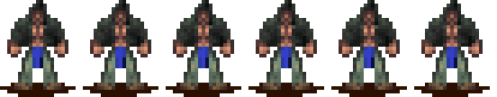 | Cadence capture open |
| [ ] | Moving, path, marker, and entrance travel | Walk row 1, ID 24 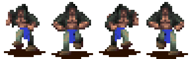 | Runtime mapping exists |
| [ ] | Fighting and training actions | Action row 3, ID 35  | Attack timing open |
| [ ] | Disguise and infiltration | Unassigned | Capture tribe-color, body-layer, and reveal transitions |
| [ ] | Special row ownership | Native table points ID 101 at subtype 5; extractor labels ID 101 as firewarrior | Resolve the table/extractor conflict before use |
| [ ] | Dying and dead hold | Die row 6, ID 30 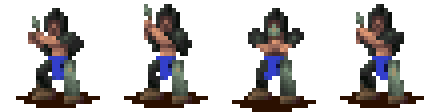 | One-shot and final-frame rules open |
| [ ] | Fleeing and fast exit | Run row 25, ID 159 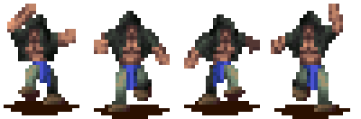 | Exit capture open |
| [ ] | Drowning and waiting in water | Swim row 16, ID 86  | Waterline offset open |
| [ ] | SitDown | IDs 134, 139, 144, and 149 | Variant selector open |
| [ ] | Vehicle entry, travel, and exit | Walk, vehicle ID 81, ride ID 113, then run | Transition capture open |
| [ ] | Carry, dig, build, and work rows | Extracted but unassigned | Do not inherit brave construction rules |
| [ ] | Spawning, sacrifice, conversion, teleport, and internal states | Unassigned | Handler evidence required |

## Extracted sequence inventory

| Check | Native row or sequence | Logical ID | Original frames |
|---|---|---:|---|
| [ ] | Idle | 18 |  |
| [ ] | Walk | 24 |  |
| [ ] | Die | 30 |  |
| [ ] | Action | 35 |  |
| [ ] | Celebrate | 41 | 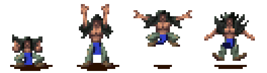 |
| [ ] | Spell idle | 46 | 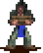 |
| [ ] | Spell walk | 51 | 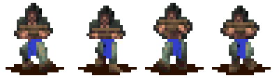 |
| [ ] | Work 1 | 56 | 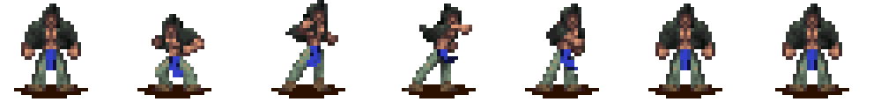 |
| [ ] | Work 2 | 61 | 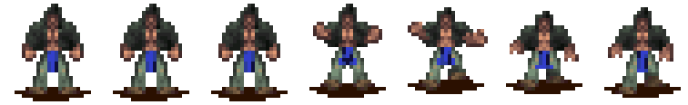 |
| [ ] | Work 3 | 66 | 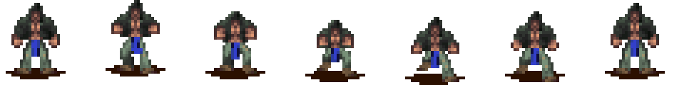 |
| [ ] | Work 4 | 71 |  |
| [ ] | Work 5 | 76 |  |
| [ ] | Vehicle | 81 | 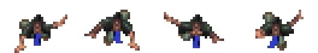 |
| [ ] | Swim | 86 |  |
| [ ] | Carry | 91 |  |
| [ ] | Ride | 113 | 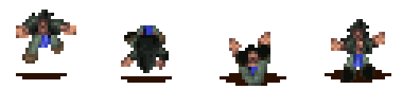 |
| [ ] | Dig / internal 1 | 118 | 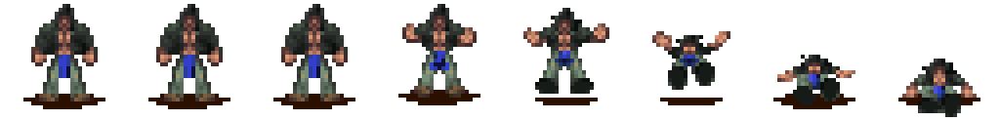 |
| [ ] | Build / internal 2 | 123 | 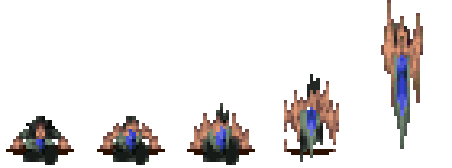 |
| [ ] | Sit 1 | 134 | 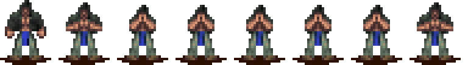 |
| [ ] | Sit 2 | 139 | 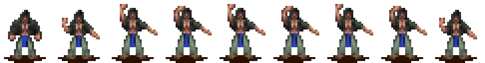 |
| [ ] | Sit 3 | 144 | 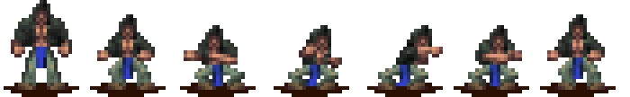 |
| [ ] | Sit 4 | 149 | 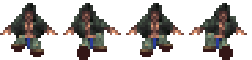 |
| [ ] | Run | 159 |  |

## Acceptance

- [ ] The renderer keeps subtype `5` through each state transition.
- [ ] The resolved VSTART and render type match the logical ID.
- [ ] The Rust frame count and order match the strip.
- [ ] Training produces subtype `5` at the building entrance.
- [ ] Disguise changes tribe presentation without changing the underlying subtype.
- [ ] A binary audit resolves logical ID 101 ownership.
