# Warrior animation checklist

Native subtype: `3`

Primary mechanics: training, movement, melee combat, vehicles, and water

Extracted original-game sequences: `23`

Shared rules: [person state and animation checklist](../person-state-animation-checklist.md)

## Current Rust state adapter

| Check | Exact `PersonState` values | Row and warrior ID | Verification |
|---|---|---|---|
| [ ] | `Idle`, `InsideTraining`, `InShield`, `WaitingAtReincPillar` | Idle row 0, ID 16 | Capture open |
| [ ] | `Moving`, `Wander`, `GoToPoint`, `FollowPath`, `GoToMarker`, `WaitForPath`, `WaitAtMarker`, `EnterBuilding`, `WaitOutside`, `Training`, `Housing`, `Gathering`, `Spawning`, `BeingConverted`, `WaitingAfterConvert`, `WaitingForBoat`, `Placeholder`, `GetOffBoat`, `EnteringVehicle`, `Teleporting`, `InternalState`, `InShieldIdle` | Walk row 1, ID 22; zero speed falls back to ID 16 | Mixed verified and provisional mappings |
| [ ] | `InsideBuilding`, `InTraining`, `Fighting` | Action row 3, ID 33 | Handler overrides open |
| [ ] | `Dying`, `Dead`, `BeingSacrificed` | Die row 6, ID 28 | Sacrifice mapping open |
| [ ] | `Celebrating` | Celebrate row 7, ID 39 | Capture open |
| [ ] | `GatheringWood` | Work row 13, ID 74 | Mechanic assignment open |
| [ ] | `Drowning`, `WaitingInWater` | Swim row 16, ID 84 | Waterline capture open |
| [ ] | `CarryingWood` | Carry row 18, ID 89 | Mechanic assignment open |
| [ ] | `Building` | Walk row 1, ID 22 | Warriors must not receive brave construction jobs |
| [ ] | `SitDown` | Sit row 21, ID 132 | Three other variants remain unselected |
| [ ] | `Fleeing`, `Preaching`, `ExitingVehicle` | Run row 25, ID 157 | Handler use open |

## State mapping

| Check | States or mechanic | Planned sequence | Status |
|---|---|---|---|
| [ ] | Idle-class states | Idle row 0, ID 16 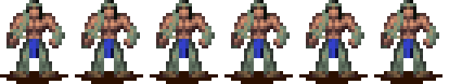 | Cadence capture open |
| [ ] | Moving, path, marker, and entrance travel | Walk row 1, ID 22 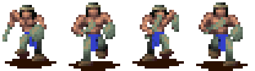 | Runtime mapping exists |
| [ ] | Fighting and training actions | Action row 3, ID 33  | Attack and hit timing open |
| [ ] | Dying and dead hold | Die row 6, ID 28 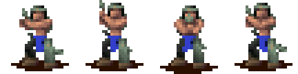 | One-shot and final-frame rules open |
| [ ] | Fleeing and fast exit | Run row 25, ID 157 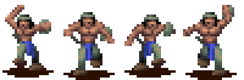 | Exit capture open |
| [ ] | Drowning and waiting in water | Swim row 16, ID 84  | Waterline offset open |
| [ ] | SitDown | IDs 132, 137, 142, and 147 | Variant selector open |
| [ ] | Vehicle entry, travel, and exit | Walk, vehicle ID 79, ride ID 111, then run | Transition capture open |
| [ ] | Carry, dig, build, and work rows | Extracted but unassigned | Do not inherit brave construction rules |
| [ ] | Spawning, sacrifice, conversion, teleport, and internal states | Unassigned | Handler evidence required |

## Extracted sequence inventory

| Check | Native row or sequence | Logical ID | Original frames |
|---|---|---:|---|
| [ ] | Idle | 16 |  |
| [ ] | Walk | 22 |  |
| [ ] | Die | 28 |  |
| [ ] | Action | 33 |  |
| [ ] | Celebrate | 39 |  |
| [ ] | Spell idle | 44 |  |
| [ ] | Spell walk | 49 | 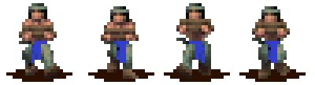 |
| [ ] | Work 1 | 54 | 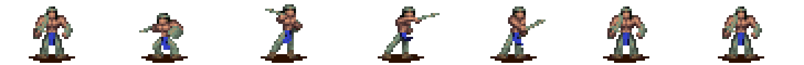 |
| [ ] | Work 2 | 59 | 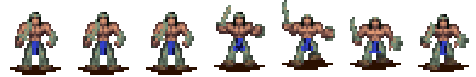 |
| [ ] | Work 3 | 64 | 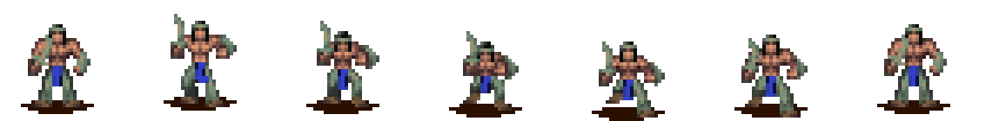 |
| [ ] | Work 4 | 69 |  |
| [ ] | Work 5 | 74 |  |
| [ ] | Vehicle | 79 | 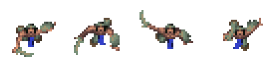 |
| [ ] | Swim | 84 |  |
| [ ] | Carry | 89 |  |
| [ ] | Ride | 111 |  |
| [ ] | Dig / internal 1 | 116 | 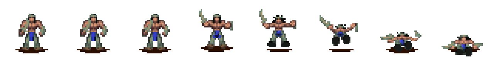 |
| [ ] | Build / internal 2 | 121 | 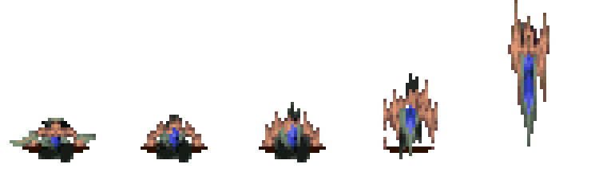 |
| [ ] | Sit 1 | 132 | 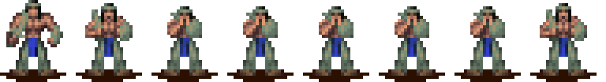 |
| [ ] | Sit 2 | 137 | 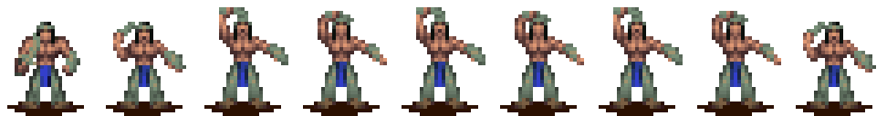 |
| [ ] | Sit 3 | 142 |  |
| [ ] | Sit 4 | 147 |  |
| [ ] | Run | 157 |  |

## Acceptance

- [ ] The renderer keeps subtype `3` through each state transition.
- [ ] The resolved VSTART and render type match the logical ID.
- [ ] The Rust frame count and order match the strip.
- [ ] Training produces subtype `3` at the building entrance.
- [ ] Original-game and Rust captures agree on combat cadence and movement.
